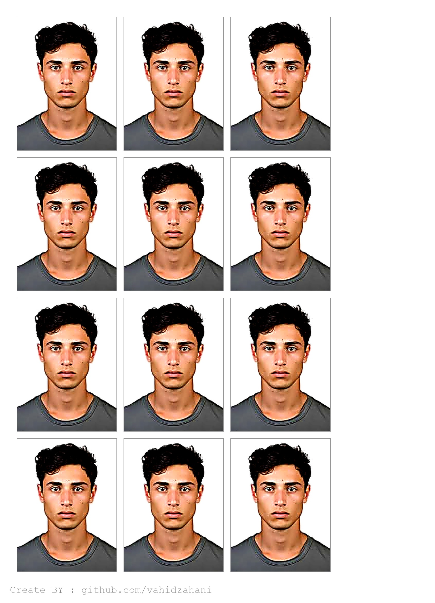

# 🖼️ AutoPassPhoto – Passport Photo Sheet Generator

This project automatically processes a personal photo by:
- Removing the background
- Enhancing the image quality
- Resizing it to 3x4 cm passport size
- Placing multiple copies on a 13x18 cm photo sheet with borders and watermark
- Exporting clean, printable JPEGs

## 📌 Features

- ✅ Background removal (via [rembg](https://github.com/danielgatis/rembg))
- ✅ White background replacement
- ✅ Photo quality enhancement (brightness, contrast, sharpness)
- ✅ Passport size scaling (3x4 cm at 300 DPI)
- ✅ Automatic layout on 13x18 cm photo sheet
- ✅ Thin gray border around each photo
- ✅ Bottom-left watermark with transparency
- ✅ Fully modularized code – each step in its own function
- ✅ JSON output for future integration

---

## 🧾 Example Input

`input.jpg` (original personal image)


---

## 🎯 Output Files

| File Name         | Description                        |
|------------------|------------------------------------|
| `photo_3x4.jpg`   | Cropped and cleaned 3x4 photo      |
| `photo_13x18.jpg` | Full 13x18 cm sheet layout         |

**Preview of Output 3x4:**


**Preview of Sheet (13x18):**



---

## ⚙️ Installation

> Requires Python 3.8+ and pip

1. Clone this repository:
   ```bash
   git clone https://github.com/yourusername/AutoPassPhoto.git
   cd AutoPassPhoto
